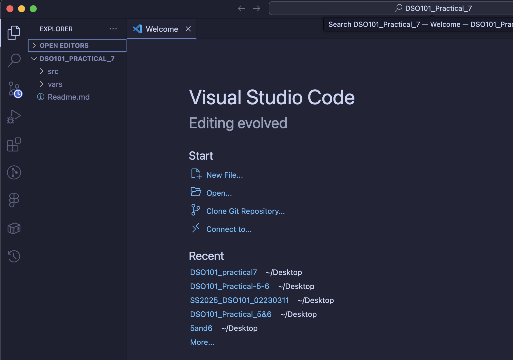
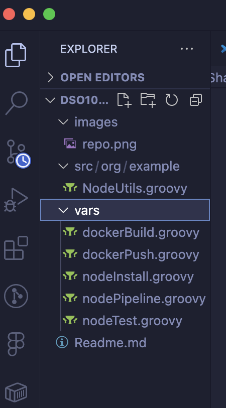
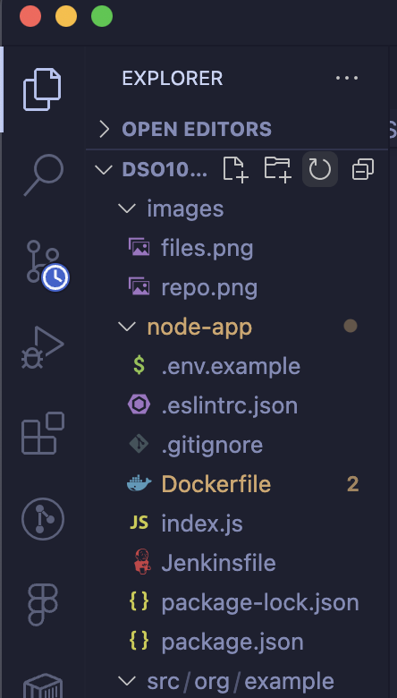
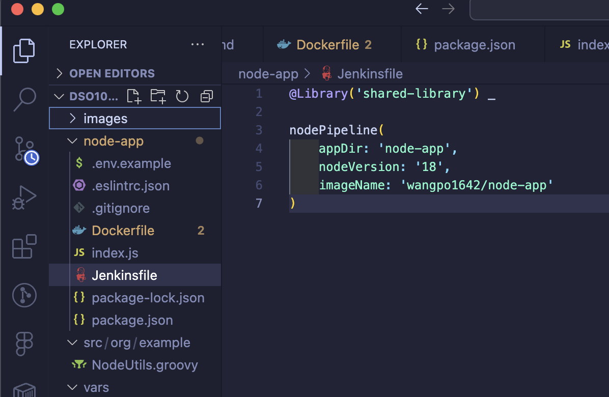
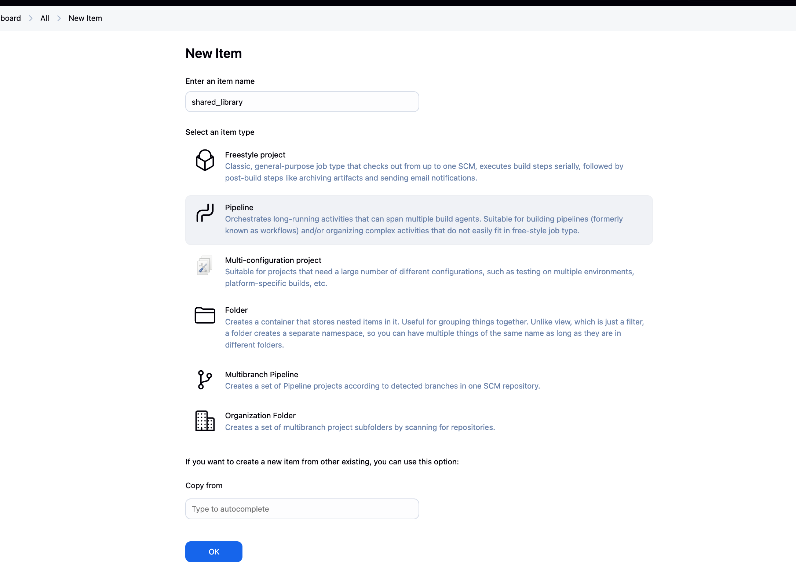

# Practical 7: Jenkins Shared Library for Node.js Applications

## Objective

The objective of this practical exercise was to create a reusable Jenkins Shared Library that centralizes common pipeline logic for Node.js applications. The shared library includes steps for installing dependencies, running tests, building Docker images, and pushing to DockerHub. This approach promotes consistent builds, reduces copy-paste errors, and simplifies maintenance across multiple projects.

## Steps Involved 

### 1. Create the Shared Library Repository Structure

### 2. Create Shared Library Files

### 3. Create Example Node.js Application

Example Jenkinsfile

### 4. Configure Jenkins

Navigate to "Manage Jenkins" > "Configure System"

Add a new Global Pipeline Library:

Name: shared-library

Default version: main

Retrieval method: "Modern SCM" > "Git"

Project repository URL: Your Git repository URL

### 5. Create Jenkins Pipeline Job

Create a new Pipeline job in Jenkins

Configure source code management to pull from your application repository

Set the Jenkinsfile path

Path set as example-app/Jenkinsfile

Run the pipeline

Image pushed in dockerhub

## Learning Outcomes

- Shared Library Architecture: Understood how Jenkins shared libraries are structured with vars/, src/, and resources/ directories

- Pipeline as Code: Learned to write reusable pipeline components that can be shared across projects

- Groovy Scripting: Gained experience writing Groovy functions and classes for Jenkins automation

- Docker Integration: Implemented Docker-based build and deployment stages in Jenkins pipelines

- Error Handling: Learned to debug Jenkins pipeline issues using console output and error messages

- Version Control: Understood the importance of committing all necessary files (like package-lock.json/package.json) for CI/CD

- Jenkins Configuration: Learned to configure global shared libraries and credentials in Jenkins

## Conclusion

This practical successfully demonstrated the creation and implementation of a Jenkins shared library for Node.js projects. The shared library approach significantly improves code reusability and maintenance in CI/CD pipelines.

The shared library can now be used across multiple projects, ensuring consistent build processes, reducing duplication, and making pipeline maintenance much easier. This practical provides hands-on experience with advanced Jenkins concepts that are directly applicable in real-world DevOps scenarios.# DSO101_practical7
