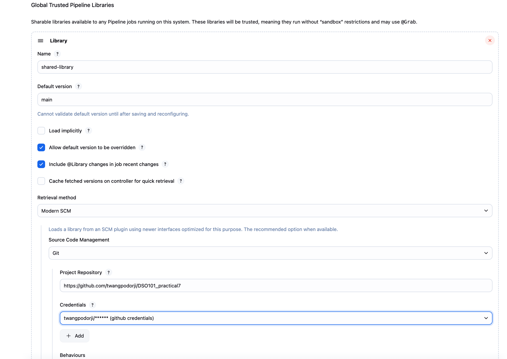
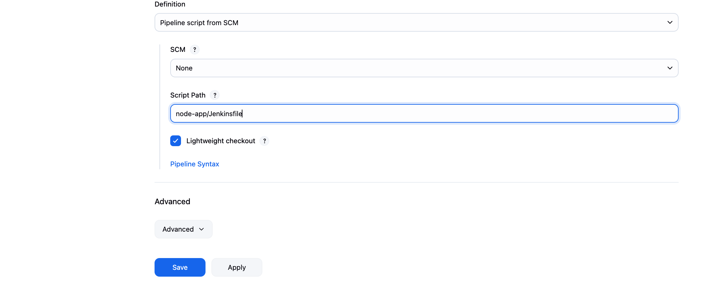
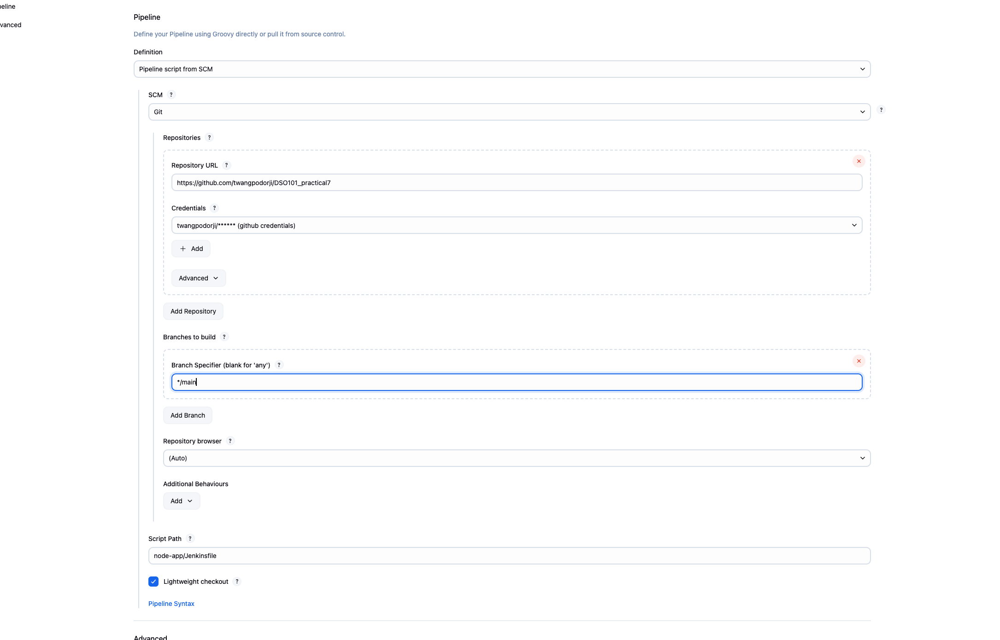

# Practical 7: Jenkins Shared Library for Node.js Applications

## Objective

The objective of this practical exercise was to create a reusable Jenkins Shared Library that centralizes common pipeline logic for Node.js applications. The shared library includes steps for installing dependencies, running tests, building Docker images, and pushing to DockerHub. This approach promotes consistent builds, reduces copy-paste errors, and simplifies maintenance across multiple projects.

## Steps Involved 

### 1. Create the Shared Library Repository Structure

### 2. Create Shared Library Files

### 3. Create Example Node.js Application

Example Jenkinsfile

### 4. Configure Jenkins

Navigate to "Manage Jenkins" > "Configure System"

Add a new Global Pipeline Library:

Name: shared-library

Default version: main

Retrieval method: "Modern SCM" > "Git"

Project repository URL: Your Git repository URL

### 5. Create Jenkins Pipeline Job

Create a new Pipeline job in Jenkins

Configure source code management to pull from your application repository

Set the Jenkinsfile path

Path set as node-app/Jenkinsfile

Run the pipeline

